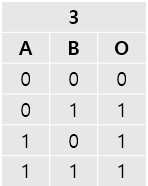

## [2021-DefCon CTF Qual] Rick Walkthrough

### TL; DR

1. Convert packet data to symbol tree
2. Identify the correspondence between the values of nodes and logic gates
3. Transform symbol tree into logic expression
4. Solve the expression with Z3

---

### Introduction

This challenge takes the form of a game. Push the lever correctly to open the door, and go to next level. 


From the level 11, the problem becomes hardly solvable for a human within time limit. So what players have to do is revealing the problem information from server-side packets, and writing a script to solve problems automatically.


---

### Play the Game 

Before analyzing `rick` statically, I played it several times to understand the rules of the game.

These are what I learned:

1. There is time limit.
2. Pushing every lever is not a solution.
3. Up to level 10, the problem is always the same.
4. From level 11, the difficulty of problems rises drastically.

---

### Collect the Packets

#### Server-side

I collected the packets from `rick.challenges.ooo:4343` during the game, and try to find some pattern.

This is the TCP payload sent from the server when starting the level 1.


And this is from level 2.


Comparing packets of level 1 to 10, I can assume that packets sent from the server would have the following structure.


Also, I noticed that even in same level, `data[n]` is always different in every run-time. Since the problems of lower levels never change, I concluded that `data[n]` is somehow encoded.


#### Client-side

I collected the packets sent by `rick`. It's quite shorter than server's.

These are the TCP payload when clearing the level 1 and 2. I cannot find any information from it.


---

### Read the Binary

To figure out the protocol between the client and the server, I read the `rick`.

#### 0x7C69: Receive num of data 

On address 0x7c69, there is do-while loop receiving 4-bytes from server and saving it into `num_of_data`.

```c
do
  {
    if ( recv(a1->fd, num_of_data, 1uLL, 0) != 1 || size == 0x4F4B )
    {
      std::__ostream_insert<char,std::char_traits<char>>(std::cerr, "disconnected", 12LL);
      v31 = *(std::cerr[0] - 24LL);
      v32 = *(&std::cerr[30] + v31);
      if ( !v32 )
        std::__throw_bad_cast();
      if ( v32[56] )
      {
        v33 = v32[67];
      }
      else
      {
        std::ctype<char>::_M_widen_init(*(&std::cerr[30] + v31));
        v33 = 10;
        v65 = *(*v32 + 48LL);
        if ( v65 != std::ctype<char>::do_widen )
          v33 = (v65)(v32, 10LL, a2, a3, a4, a5);
      }
      v34 = std::ostream::put(std::cerr, v33);
      std::ostream::flush(v34);
      a1->byte39 = 0;
      return __readfsqword(0x28u) ^ v95;
    }
    num_of_data = (num_of_data + 1);
  }
while ( &v95 != num_of_data );
```

#### 0x7CC5: Receive data

Then it receives `4 * num_of_data` into `a1->data`

```c
v9 = 4 * num_of_data;
data = malloc((4 * num_of_data));
fd = a1->fd;
a1->data = data;
if ( read_fd(fd, data, v9) == -1 )             // read_data
  goto LABEL_54;
```

#### 0x7D58: Decode data - logic gate

`data[0]` is divided by 10, and remainder is saved into `gate`.

```c
data = a1->data;
v16 = v14;
value = data[0];
v18 = v14 + 7;
a1->qword28 = v14;
memset(v14, 0, 0x68uLL);
v14[9] = v14 + 7;
v14[3] = v14 + 1;
v14[4] = v14 + 1;
v14[10] = v14 + 7;
v80 = v14 + 1;
gate = value % 0xA;
```

#### 0x825D: Decode data - children

Call `parse_data` in n(`data[1]&f`) times.

```c
if ( gate && (n = LOBYTE(data[1]), LOBYTE(data[1])) )
  {
    cnt = 0;
    p_qword18 = &v89->qword18;
    v58 = 8;
    do
    {
      while ( 1 )
      {
        v59 = parse_data(v16, (data + v58), 1, &v89);
        v60 = *(v56 + 32);
        v90 = v59;
        if ( v60 == *(v56 + 40) )
          break;
        *v60 = v59;
        v58 += v89;
        ++cnt;
        *(v56 + 32) = v60 + 8;
        if ( n == cnt )
          goto LABEL_74;
      }
      ++cnt;
      sub_71E0(p_qword18, v60, &v90);
      v58 += v89;
    }
    while ( n != cnt );
LABEL_74:
    v16[12] = v56;
  }
```

#### 0x77D0: parse_data

The code of `parse_data` is quite similar with above routines. Calculate `gate` with `data[0] % 0xA`, 

```c
value = data[0];
v46[1] = __readfsqword(0x28u);
gate = value % 0xA;
```

and call `parse_data` recursively in `data[1] & 0xf` times.

```c
num_of_children_low = LOBYTE(data[1]);
if ( LOBYTE(data[1]) )
{
  v29 = a3 + 1;
  v30 = 0;
  p_qword18 = &v45->qword18;
  do
  {
    while ( 1 )
    {
      v31 = parse_data(a1, (data + v28), v29, &v45);
      qword20 = v27->qword20;
      v46[0] = &v31->data;
      if ( qword20 == v27->qword28 )
        break;
      *qword20 = v31;
      v28 += v45;
      ++v30;
      v27->qword20 = qword20 + 8;
      if ( num_of_children_low == v30 )
        goto LABEL_39;
    }
    ++v30;
    sub_71E0(p_qword18, qword20, v46);
    v28 += v45;
  }
  while ( num_of_children_low != v30 );
}
```

This coding pattern seems <u>recursive tree traversal algorithms</u>.

---

### Reveal the structure of packet

Based on the information analyzed, I wrote the packet parsing script.

```python
from pwn import *
from anytree import Node, RenderTree, PreOrderIter


p = remote("rick.challenges.ooo", 4343)


def encrypt(pt):
    global key
    return bytes([pt[i] ^ key[i % 4] for i in range(len(pt))])


def parse_tree(data, parent=None):
    global nodes

    val = data[0] % 0xa

    gate = str(val)

    cur_node = Node(gate, parent=parent)
    nodes.append(cur_node)

    if val == 0:
        return 1

    child_n = data[1] & 0xf
    subtree_sz = 0

    for i in range(child_n):
        subtree_sz += parse_tree(data[2+subtree_sz:], cur_node)

    return subtree_sz+2


answers = [b'1', b'01', b'11', b'0001', b'1111',
           b'10', b'11', b'10', b'1111', b'0101', b'0101']

# level 2 => 01, 10, 11
# level 6 => 01, 10, 11
# level 8 => 01, 10
# level 9 => 0101, 0110, 0111, 1001, 1010, 1011, 1111
# level 10 => 0101, 1010, 1001

key = b'RICK'
p.recvuntil('RICK')
level = 1

for level in range(1, 12):
    print(f"====LEVEL {level}====")
    sz = u32(p.recvn(4))
    challs = []
    nodes = []

    for i in range(sz):
        data = u32(p.recvn(4))
        challs.append(data)

    parse_tree(challs)

    for pre, fill, node in RenderTree(nodes[0]):
        print(f"{pre}{node.name}")

    p.sendline(encrypt(answers[level-1]))


p.interactive()

```

```bash
$ python3 parse.py
====LEVEL 1====
2
└── 0
====LEVEL 2====
3
├── 0
└── 0
====LEVEL 3====
2
├── 0
└── 0
====LEVEL 4====
3
├── 0
├── 0
├── 0
└── 0
...
====LEVEL 11====
6
├── 2
│   ├── 8
│   │   ├── 0
│   │   ├── 0
│   │   └── 0
│   └── 1
│       └── 0
└── 1
    └── 2
        ├── 0
        ├── 0
        ├── 0
        └── 0
```

It works well.

---

### Figure out the meaning of node values

I played the game again to infer the relationship between parsed information and the problem of each stage. First, I noticed that the number of `0`s is same as the number of levers. So I assume that `0` represents user-input.

Then I wrote down all correct answers, looked at the tree structure, and figured out the meaning of the other values.

#### Level 2

`3` represents `or` gate.



#### Level 3

`2` represents `and` gate.


#### Level 10

`4` represents `xor` gate.


#### Level 8

`1` represents `not` gate.


It seems very inefficient to deduce the rest of the gate by playing games. So I went back to analyze `rick`. Thankfully, our teammate [okas832](https://twitter.com/okascmy1?ref_src=twsrc%5Egoogle%7Ctwcamp%5Eserp%7Ctwgr%5Eauthor) found and informed me of the code that handles the logic gates. The code is located at `0x8322`. By analyzing the code, all the information of the remaining gates was identified.

---

### Reveal the problem from packets

I wrote the python script and it successfully reveals the problem information from packet. The full code is at the end of the article.

```plaintext
====LEVEL 1====
And
└── I
====LEVEL 2====
Or
├── I
└── I
====LEVEL 3====
And
├── I
└── I
====LEVEL 4====
Or
├── I
├── I
├── I
└── I
...
====LEVEL 11====
XorM
├── Not
│   └── I
├── Or
│   ├── I
│   └── I
└── Unk1
    ├── I
    ├── I
    ├── I
    └── I
```

---

### Solve the problem with Z3

So the problem is equivalent with solving a logical expression. I decided to solve it with Z3. Here is full solver-script(fixed by [okas832](https://twitter.com/okascmy1?ref_src=twsrc%5Egoogle%7Ctwcamp%5Eserp%7Ctwgr%5Eauthor)).

```python
from pwn import *
from z3 import *
from anytree import Node, RenderTree, PreOrderIter


p = remote("rick.challenges.ooo", 4343)

logic_table = {0: "I", 1: "Not", 2: "And",
               3: "Or", 4: "XorM", 5: "Nand", 6: "Nor", 7: "Seq", 8: "Unk1", 9: "Unk2"}


def encrypt(pt):
    global key
    return bytes([pt[i] ^ key[i % 4] for i in range(len(pt))])


def XorM(*args):
    # multiple input XOR
    res = Xor(args[0], args[1])
    for var in args[2:]:
        res = Xor(res, var)
    return res


def Nand(*args):
    return Not(And(args))


def Nor(*args):
    return Not(Or(args))


def Seq(*args):
    if len(args) == 1:
        return Not(Xor(args[0], args[0]))
    else:
        tmps = []

        for i in range(len(args)-1):
            tmps.append(Xor(args[i], args[i+1]))

        return And(*tmps)


def Unk1(*args):
    return Nor(args[0], args[len(args)-1])


def Unk2(*args):
    return And(args[0], args[len(args)-1])


def parse_tree(data, parent=None):
    global nodes

    val = data[0] % 0xa

    try:
        gate = logic_table[val]
    except:
        gate = str(val)

    cur_node = Node(gate, parent=parent)
    nodes.append(cur_node)

    if val == 0:
        return 1

    child_n = data[1] & 0xf
    subtree_sz = 0

    for i in range(child_n):
        subtree_sz += parse_tree(data[2+subtree_sz:], cur_node)

    return subtree_sz+2


def preorder(root, ans=None):
    if not root:
        return ans

    if ans == None:
        ans = []

    ans.append(root.name)

    if len(root.children) != 0:
        ans.append('(')
        for child in root.children:
            preorder(child, ans)

        ans.append('), ')
    return ans


def solve(root):
    answer = bytes()
    expr = ''
    vars = []
    var_cnt = 0
    ordered_syms = preorder(root)

    for sym in ordered_syms:
        if sym == 'I':
            var_name = 'vars['+str(var_cnt)+']'
            vars.append(Bool(var_name))
            var_cnt += 1

            expr += var_name + ', '
        elif sym != None:
            expr += sym

    print(f"Expression: {expr}")

    s = Solver()
    s.add(eval(expr))

    if s.check() == sat:
        model = s.model()

        print(model)

        for i in vars:
            answer += str(int(bool(model[i]))).encode()

    return answer


answers = [b'1', b'01', b'11', b'0001', b'1111',
           b'10', b'11', b'10', b'1111', b'0101', b'0101']

# level 2 => 01, 10, 11
# level 6 => 01, 10, 11
# level 8 => 01, 10
# level 9 => 0101, 0110, 0111, 1001, 1010, 1011, 1111
# level 10 => 0101, 1010, 1001

key = b'RICK'
p.recvuntil('RICK')
level = 1

while 1:
    print(f"====LEVEL {level}====")
    sz = u32(p.recvn(4))
    challs = []
    nodes = []

    for i in range(sz):
        data = u32(p.recvn(4))
        challs.append(data)

    parse_tree(challs)

    # for pre, fill, node in RenderTree(nodes[0]):
    #     print(f"{pre}{node.name}")

    answer = solve(nodes[0])
    print(f"Answer: {answer.decode()}")

    p.sendline(encrypt(answer))
    level += 1

    if level == 101:
        break

key = p.recvn(4)
sz = u32(p.recvn(4))
dat = p.recvn(sz)

print(encrypt(dat))

p.interactive()
```

```bash
$ python3 solve.py
====LEVEL 1====
Expression: And(vars[0], ),
[vars[0] = True]
Answer: 1
====LEVEL 2====
Expression: Or(vars[0], vars[1], ),
[vars[1] = False, vars[0] = True]
Answer: 10
====LEVEL 3====
Expression: And(vars[0], vars[1], ),
[vars[1] = True, vars[0] = True]
Answer: 11
...
b'OOO{never_gooonna_give_yooou_up_but_Im_gooonna_give_yooou_this_flag}\n'
```


