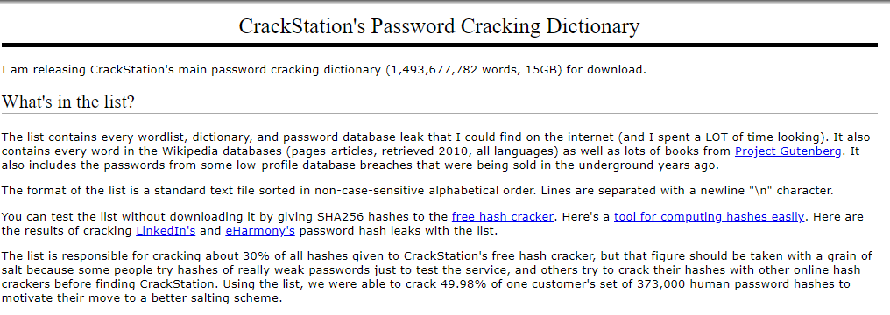
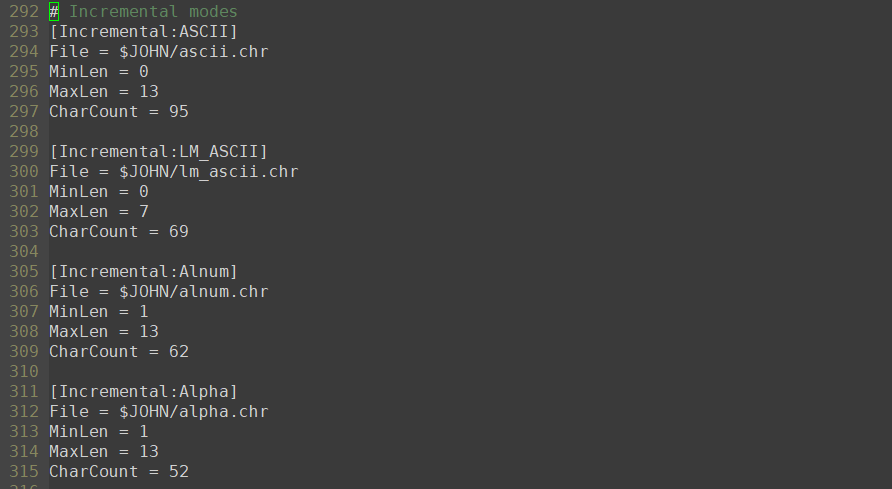
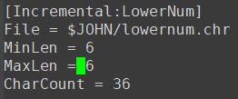

**이 가이드 문서는 원래 대학교 3학년 때 학교 과제로 제출했던 건데, 최근에 후배한테 질문이 들어와서 꺼내봤다가 블로그에 포스팅하면 딱일 것 같아서 포스팅하게 됐습니다.*

---

## John The Ripper 소개

### JTR 이란?

JTR은 `openwall`에서 개발한 패스워드 크래킹 툴입니다. wordlist를 기반으로한 dictionary attack, bruteforcing attack을 이용할 수 있습니다. 또한 `john.conf`라는 설정파일을 이용하여 브루트포싱의 효율을 높일 수 있습니다.

------

### JTR 설치 가이드

JTR은 리눅스의 여러 버전에서 간단하게 설치가 가능합니다.

- Ubuntu

  ```bash
  $sudo apt-get install john
  ```

- Fedora

  ```bash
  $sudo yum install john
  ```

------

### JTR 모드

1. **Single mode**

   유저의 계정정보를 이용하여 크랙합니다.

2. **Wordlist mode**

   패스워드 딕셔너리를 이용하여 대입공격을 합니다. 이 경우 비밀 번호가 공격대상과 연관되는 단어 또는 단어들의 조합일 경우 쉽게 크랙이 될 수 있습니다.

3. **Incremental mode**

   브루트포싱을 합니다. 일반적으로 보안을 고려하여 비밀번호를 작성한다면 Wordlist mode, single mode에서 크랙되는 일은 없을 것입니다. 전혀 연관성 없는 어려운 단어를 복잡하게 섞거나, 애초에 단어가 아니게 비밀번호를 설정할 것입니다. 그런 경우에 incremental mode가 해결해줄 수 있습니다. 만약 패스워드의 제약사항(ex, ASCII only, 길이)등을 알 경우 `john.conf`를 설정하여 훨씬 수월하게 크랙을 진행할 수 있습니다.

------

### JTR 기본 사용 예시

다음의 테스트 유저를 만들어서 패스워드 해시를 하나 생성하겠습니다.

```bash
$sudo useradd jtr
Adding user `jtr' ...
Adding new group `jtr' (1009) ...
Adding new user `jtr' (1009) with group `jtr' ...
Creating home directory `/home/jtr' ...
Copying files from `/etc/skel' ...
Enter new UNIX password: cat123
Retype new UNIX password: cat123
passwd: password updated successfully
Changing the user information for jtr
Enter the new value, or press ENTER for the default
	Full Name []: 
	Room Number []: 
	Work Phone []: 
	Home Phone []: 
	Other []: 
Is the information correct? [Y/n] Y
```

그리고 크래킹의 편의를 위해 해당 해시만 긁어서 파일을 따로 만듭니다.

```
jtr:$6$FjlqEar2$0tTze/zb1bAiooyWi.EAOaTuG5K88RT9w8I.swGy0vVpCtG2d5cwtbrKmxzlsRDBLtFgMJUve1qjFETlriOld/:18071:0:99999:7:::
```

JTR을 이용하여 크랙을 합니다. 아래 예시처럼 아무런 작동 모드를 명시하지 않으면,

1. Single crack mode
2. Word-list mode
3. Incremental mode

순서로 크랙킹을 시도합니다.

```bash
$john test.shadow
0g 0:00:00:10 1% 2/3 0g/s 488.1p/s 488.1c/s 488.1C/s pretty..celtic
0g 0:00:00:13 3% 2/3 0g/s 490.9p/s 490.9c/s 490.9C/s friends..saturn
0g 0:00:00:32 8% 2/3 0g/s 496.7p/s 496.7c/s 496.7C/s kerrya1..Iloveyou1
0g 0:00:00:33 9% 2/3 0g/s 496.8p/s 496.8c/s 496.8C/s Captain1..Marty1
0g 0:00:00:34 9% 2/3 0g/s 496.9p/s 496.9c/s 496.9C/s Predator1..Wendy1
0g 0:00:00:35 9% 2/3 0g/s 497.0p/s 497.0c/s 497.0C/s Lester1..Pancake1
0g 0:00:00:36 9% 2/3 0g/s 497.1p/s 497.1c/s 497.1C/s Iverson1..Babylove1
0g 0:00:00:38 10% 2/3 0g/s 497.2p/s 497.2c/s 497.2C/s Newton1..Barn1
0g 0:00:00:40 11% 2/3 0g/s 497.2p/s 497.2c/s 497.2C/s enigmaenigma..laurellaurel
0g 0:00:00:41 11% 2/3 0g/s 497.2p/s 497.2c/s 497.2C/s andersanders..freddyfreddy
0g 0:00:01:09 19% 2/3 0g/s 498.8p/s 498.8c/s 498.8C/s picasso!..utopia!
0g 0:00:01:43 29% 2/3 0g/s 499.6p/s 499.6c/s 499.6C/s aptiva4..dork4
0g 0:00:01:44 29% 2/3 0g/s 499.6p/s 499.6c/s 499.6C/s heikki4..ship4
0g 0:00:01:45 30% 2/3 0g/s 499.6p/s 499.6c/s 499.6C/s clancy8..monopoly8
0g 0:00:01:49 31% 2/3 0g/s 499.6p/s 499.6c/s 499.6C/s admin8..daily8
0g 0:00:01:50 31% 2/3 0g/s 499.7p/s 499.7c/s 499.7C/s car8..irmeli8
0g 0:00:01:51 31% 2/3 0g/s 499.7p/s 499.7c/s 499.7C/s larry6..buttons6
0g 0:00:01:52 32% 2/3 0g/s 499.7p/s 499.7c/s 499.7C/s jackie6..police6
0g 0:00:01:53 32% 2/3 0g/s 499.7p/s 499.7c/s 499.7C/s haha6..leader6

...
0g 0:01:00:27 3/3 0g/s 501.7p/s 501.7c/s 501.7C/s crungit..cruiese
```

기본 설정으로는 `cat123`라는 단순한 비밀번호임에도 1시간이 지나도 비밀번호를 찾지 못합니다.

------

### JTR 효율적으로 사용하기

위의 예시처럼 기본 설정으로는 브루트포싱의 한계, 그리고 제한적인 wordlist의 한계 때문에 상당한 시간이 소요되도 비밀번호를 찾아내지 못합니다.

JTR을 사용하다보면 이런 경우가 비일비재합니다.

다음의 방법으로 이런 단점을 보완할 수 있습니다.

1. 양적, 질적으로 보다 나은 wordlist확보
2. incremental에 제한사항을 추가하여 효율적인 브루트포싱

### 좋은 wordlist확보

이미 상당히 다양한 wordlist들을 구글을 통해 구할 수 있습니다. 걔중에는 해킹을 통해 탈취한 비밀번호들을 이용한 것들도 있으며, 용량이 굉장히 큰 것들도 있습니다.



*!15GB wordlist!*

위 워드리스트를 사용하면 상당한 시간이 소요되겠지만, 웬만한 비밀번호들은 모두 크랙될 것입니다.

만약 소셜엔지니어링을 활용하여 공격대상의 정보를 알고 있다면 이를 wordlist에 추가하여 더더욱 효율적인 크래킹을 할 수 있을 것입니다.

### 브루트포싱에 제약주기

`incremental`에는 그 안에 여러 세부 모드가 있습니다. 기본적으로 브루트포싱 할 `char_set(ascii, alnum ...)`을 기준으로 모드가 나뉘며, 각 세부 모드마다 `john.conf`를 통해 추가적인 설정을 할 수 있습니다.



각 세부모드마다 `MinLen, MaxLen, CharCount`를 조절할 수 있습니다. 만약 비밀번호의 길이를 정확히 알고 있거나, 좁은 범위로 제한할 수 있다면 훨씬 효율적인 브루트포싱을 할 수 있을 것입니다.

---

### `jtr:cat123` 다시 크랙해보기

사실 길이가 조금만 길어져도 브루트포싱을 통한 크랙이 힘듭니다. 위의 `cat123`를 최대한 효율적으로 브루트포싱하려면 `incremental:LowerNum`을 이용해야하는데, 길이를 6으로 특정하더라도 2,176,782,336‬(36^6)이라는 상당히 많은 수를 탐색해야합니다.

요즘 개발되는 웹사이트들은 8자 이상의 비밀번호에 특수문자 사용까지 권장하는 경우가 많으므로, `incremental`으로 비밀번호를 찾는 것은 불가능에 가깝다고 봐도 좋습니다. (ascii, 8자로 특정시 6,634,204,312,890,625‬의 경우가 존재)

따라서 좋은 wordlist를 확보하고 이용하는 것이 바람직합니다. 물론 이 경우에도 빠르게 크랙하고 싶다면 소셜엔지니어링을 통해 공격대상에 특정적인 wordlist를 작성하고 사용하는 것이 좋습니다. 위 예의 15기가 wordlist를 이용하여 크랙하는 것은 높은 확률로 결과를 보장할 지언정, 효율적이라고 보기는 어려울 것입니다.

- **좋은 wordlist 확보**

  `rockyou`라는 용량이 적절하고, 대중적으로 유명한 wordlist를 사용하여 크랙해보겠습니다.

  ```
  $john --wordlist=/usr/share/john/rockyou.txt test.shadow                     
  Loaded 1 password hash (crypt, generic crypt(3) [?/64])
  Press 'q' or Ctrl-C to abort, almost any other key for status
  0g 0:00:00:03 0% 0g/s 490.7p/s 490.7c/s 490.7C/s clover..punkrock
  cat123           (jtr)
  1g 0:00:00:05 100% 0.1700g/s 489.7p/s 489.7c/s 489.7C/s meagan..soccer9
  Use the "--show" option to display all of the cracked passwords reliably
  Session completed
  $john --show test.shadow
  jtr:cat123:18071:0:99999:7:::
  
  1 password hash cracked, 0 left
  ```

  대략 5초면 크랙이 끝나는 것을 확인할 수 있습니다.

- **최적화된 incremental룰 이용**

  

  위와 같이 최적화를 거친 룰로 incremental모드를 이용해보겠습니다.

  ```
  $john --incremental:lowernum test.shadow
  Loaded 1 password hash (crypt, generic crypt(3) [?/64])
  Press 'q' or Ctrl-C to abort, almost any other key for status
  0g 0:00:04:04 0g/s 486.1p/s 486.1c/s 486.1C/s sunkar..sungar
  0g 0:00:04:16 0g/s 486.1p/s 486.1c/s 486.1C/s 042200..042388
  0g 0:00:06:13 0g/s 485.9p/s 485.9c/s 485.9C/s sixsty..sixa73
  0g 0:00:07:06 0g/s 485.8p/s 485.8c/s 485.8C/s monard..momett
  0g 0:00:07:08 0g/s 485.8p/s 485.8c/s 485.8C/s mils22..misak1
  0g 0:00:08:37 0g/s 486.0p/s 486.0c/s 486.0C/s juse22..juapls
  0g 0:00:08:38 0g/s 485.9p/s 485.9c/s 485.9C/s jernor..jensk1
  ...
  ```

  상당한 시간이 소요됩니다.

위의 예시에서도 볼 수 있고, 당연한 얘기지만 일반적으로 상상할 수 있는 단어로 이루어진 비밀번호의 크랙은 wordlist가 압도적으로 빠릅니다. 따라서 빠르게 비밀번호를 크랙하고 싶고, 비밀번호가 상식적인 패턴을 가졌을 것이라고 생각된다면, 적절한 용량의 wordlist에 그 사람과 관련된 단어를 추가한 wordlist를 만들어서 사용하는 것이 좋습니다.

------

## 한국인의 비밀번호를 위한 JTR

### 한국인 비밀번호의 특성

한국인의 비밀번호는 영미권의 것들과 많이 다릅니다. 다음과 같은 예시들이 있습니다.

- 이름 : `minsu`,`yena` vs `jessica`,`taylor`
- 한글 => 영어 : 민수 => alstn, 예나 => dPsk, 사과 => tkrhk, 수박 => tnqkr

기본적으로 이름이 영미권과 확연히 다르며, 한글 단어를 있는 그대로 쳐서 영어로 넣기 때문에 영어로 볼 시 일반적인 패턴이 나타나지 않습니다.

따라서 효율적인 크랙킹을 위해선 한국인의 특성이 반영된 wordlist가 필요합니다.

------

### 한국인 특성이 반영된 wordlist 구성

우선 기본 wordlist로 교수님이 주신 2벌식 단어를 영어로 변환한 `korean_keystroke_wordlist.txt`를 활용합니다. 여기에 몇몇 경우를 추가하여 최종 `wordlist`를 만듭니다.

추가하기 위해 고려해야할 항목은 다음과 같습니다.

- 기본적인 약한 비밀번호
- 이름
- 지명
- 문화재
- 숫자

주어진 wordlist를 확인해보니 지명과 문화재는 이미 포함돼있었으므로 생략했습니다.

### 기본적인 약한 비밀번호

널리 알려진 약한 비밀번호들 중 한국인들이 사용할 법한 것들만 추가해줍니다.

### 이름(Family+Last)

Family : 통계청 자료를 바탕으로 가장 많이 쓰이는 성 30개를 추출했습니다.

Last: [이름랭킹](https://koreanname.me/)에서 성별별로 사용 빈도 순위 상위 30개의 이름을 추출했습니다.

이를 조합해서 총 1800개의 fullname을 만들었습니다.

완성된 fullname과 last name 모두 쓰일 수 있으므로 모두 wordlist에 추가해줍니다.

### 숫자, 특수문자

생년월일, 전화번호, 특수문자(!@#$*()_) 등을 이용하여 비밀번호를 까다롭게 하는 경우가 있으므로, 이를 `rule`을 이용하여 보완해 줍니다.

📝여기에 과제를 위해 교수님이 연상할 수 있을 법한 단어들을 추가 또는 `rule`에 반영해줍니다.

- 수업을 듣는 학우들의 이름
- 수업과 관련된 단어 : 크랙, 비밀번호, 존더리퍼, 리눅스, 유닉스, 해킹, 해커, hacking, hack, hacker, JTR, crack, password, johntheripper, linux, unix, fuzz, fedora
- 학교와 관련된 단어 : 한국, 고려, 고려대, 고려대학교, ku, KU, korea, Korea,
- 교수님과 직접 관련이 있는 인물, 회사 등 : 엔씨, 카이스트, AIspera, hksecurity, ncsoft, kaist, KAIST, A3, KUS, NCSOFT
- 교수님의 신상(?)정보 : 휘강, 김휘강, cenda, huykang, cendakim, 9452, 94, 99,
- 기타 : 해방이, 해킹방어이론, 과목37, 게임, cydf311, cydf, dropbox, ai, AI, RTFM, google, Kaizen, kaizen, starwars, netsec

------

### 발견될 빈도에 대한 추측을 바탕으로 최적화하기

### 비밀번호에 사용되지 않을 법한 단어 삭제

동사, 형용사를 비밀번호에 사용할 가능성은 매우 적습니다. 따라서 `다(ek)`로 끝나는 단어(.*ek$)들을 모두 삭제합니다.

### 길이에 대한 추론을 바탕으로 단어 목록에서 삭제

[비밀번호 길이에 관한 통계](https://www.statista.com/statistics/744216/worldwide-distribution-of-password-length/)에 따르면, 6~12자 사이에 84%이상의 비밀번호가 분포합니다. 대부분의 사이트에서 숫자와 특수문자를 섞어서 사용하기를 권장하므로, 저 안에 실제 영어 알파벳의 수는 그보다 적을 것으로 추측됩니다.

또한, 한글의 특성상 1자리에 많아야 4음소가 들어갈 수 있는데(ex, 삶), 이런 복잡한 단어를 비밀번호에 잘 사용하지 않을 뿐더러, 연속해서 2~3자리 모두에 4음소가 꽉 찬 단어는 드뭅니다. 때문에 일상적으로 비밀번호에 사용하는 단어라면, 평균적으로 한 자리에 2개이상 3개미만 정도의 음운이 들어있다고 가정해도 크게 오차가 발생하지 않을 것입니다.

추가적으로, 우리가 평소 사용하는 단어는 길이가 2자 에서 3자 입니다. 따라서 비밀번호에 사용된 단어들은, 평균적으로 4개이상 9개미만의 음운으로 이뤄졌다고 생각할 수 있습니다. 이를 알파벳으로 치환하면, 한글 단어를 영타로 쳤을 때 그 길이가 4~8자가 된다고 볼 수 있습니다.

위 3가지 정보를 종합해보면 한국인이 비밀번호에 포함시키는 단어는 영타로 쳤을 때 길이가 4~9자 사이가 될 가능성이 높습니다. 이에 근거하여 wordlist에서 너무 길거나 짧은 단어들을 모두 제거합니다.

### 한국인의 단어사용 빈도 반영

국립국어원의 [현대 국어 사용 빈도 조사](https://www.korean.go.kr/front/reportData/reportDataView.do?mn_id=207&report_seq=1)를 참조하여 한국인이 가장 많이 사용하는 명사 100개를 추리고, wordlist앞에 배치합니다. 이 때도 길이조건을 고려합니다.

### Wordlist 우선순위 결정

JTR은 wordlist를 앞에서 부터 순차적으로 탐색합니다. 따라서 빈도를 고려한 배치가 시간을 절약 시켜줄 수 있습니다.

**교수님이 연상할 만한 단어 => 한국인이 자주 쓰는 단어 => 이름 => 그 외 단어**

순으로 배치하였습니다.

### Rule 설정하기

기본적으로 JTR의 rule들은 영어 비밀번호를 대상으로 작성됐습니다. 대소문자를 전환하는 등의 룰은 한글 단어의 뜻을 변화시킵니다. 이런 불필요한 룰들을 전부 지우고, 길이가 짧을 때 반복하는 규칙만 남겨둡니다.

안전한 비밀번호라 하면 특수문자, 단어, 숫자를 섞어서 만듭니다. 그런데 경험상 '특수문자, 단어, 숫자'는 경계를 두고 섞이는 것이 일반적입니다. 만약 이 세 요소가 경계없이 섞인다면 사전대입 공격으로 이를 찾는 것은 불가능에 가깝습니다. 따라서 '특수문자, 단어, 숫자'는 경계를 두고 섞인다고 가정하겠습니다.

각 요소를 사용할 때 일반적으로 다음의 습관이 있습니다.

- 특수문자(`!@#$*`)

  - 한 개를 붙인다.
  - 연속된 3개 `!@#`를 붙인다.

- 숫자

  - 1개를 붙일 때 : `0-9`
  - 2개를 붙일 때 : `12` > `21` > `1-9`,`1-9`
  - 3개를 붙일 때 : `123` > `321` > `1-9`,`1-9`,`1-9`
  - 4개를 붙일 때 : `0-9`, `0-9`, `0-9`, `0-9`

  4개가 붙을 때는 전화번호 뒤 4자리, 생월일, 또는 생년을 표현하는 경우가 많다.

### Rule 우선순위 설정

JTR은 rule을 앞에서 부터 순차적으로 탐색합니다. 따라서 빈도를 고려한 배치가 시간을 절약 시켜줄 수 있습니다.

주관적인 생각, 그리고 JTR이 규칙을 처리하는데 걸리는 시간을 바탕으로 적용할 규칙의 우선순위를 정했습니다.

```
1. !?A $1$2 : [word]12
2. !?A $1$2$3 : [word]123
3. !?A $9$4$5$2 : [word]9452
4. !?A $!$@$# : [word]!@#
5. ?A $1$2 ^[!@#$*] : [special][word]12
6. !?A $1$2$3 ^[!@#$*] : [special][word]123
7. !?A $9$4$5$2 ^[!@#$*]: [special][word]9452
8. ?A $[!@#$*] : [word][special]
9. ?A ^[!@#$*] : [special][word]
10. ?A $[0-9] : [word][number]
11. !?A $[0-9] ^[!@#$*] : [special][word][num]
12. !?A $2$1 : [word]21
13. !?A $3$2$1 : [word]321
14. !?A $9$4 : [word]94
15. !?A $9$9 : [word]99
16. ?A $3$2$1 ^[!@#$*] : [special][word]321
17. ?A $2$1 ^[!@#$*] : [special][word]21
18. !?A $[0-9] $[0-9]
19. !?A $[0-9] $[0-9] ^[!@#$*]
20. ?A $[0-9] $[0-9] $[0-9] $[0-9] : [word]\[num][num][num][num]
21. ?A $[0-9] $[0-9] $[0-9] $[0-9] ^[!@#$*] : [special][word][num][num][num][num]
22. !?A $[0-9] $[0-9] $[0-9]
23. !?A $[0-9] $[0-9] $[0-9] ^[!@#$*]
```

------

### 여러 비밀번호 유형 크랙 테스트

```
test:$6$tfLrZJ0t$upqJFerph/8bJTnv4r7c9.cZrwERDkiAH/iMw9MHbixQp6xRYtv6HIQ4e5FpTS7bhcpNFkP1agWJH0OnWm0yA1:18072:0:99999:7:::
=> 고려대학교
test:$6$3RNVVSGP$gKIQSmy8.O7IsmpYWEEuGiwjt6tbF1o4Ea63CDlBAywGnRE0QXeVnk86Lw/7bE41WEt.2CgEjQqFF2pIwDLJd0:18072:0:99999:7:::
=> 휘강123
test:$6$JIjHleOk$Sy4lysPTEU6/olEXbovzXC1AfUiFpLw0kcf25R19LMziwEdtDKkzakH9orTS.q2BOo5zh4S988RkL6yxNlSoo.:18072:0:99999:7:::
=> 김민준123
test:$6$KA2KYkvk$dAGhM3j4OdJ4O7ADTMAZPtUlSTODqBosjM7s4z86Sg4KdjPz8hcfAPNhwW9K8wF3TVxFdg9zZnnfXSa98AFxh/:18071:0:99999:7:::
=> *민준123
test:$6$7eXL3Tzf$E.onFt66Fp7Hzs7oJa3jMHsXDrH6FJEVE7qTzzIUwwXPcjfUzvAIvLZUuimhE.cczhJal7eXaILtHLUGHrnPo/:18072:0:99999:7:::
=> 수박!
```

위 5개의 비밀번호를 크랙하는데 45분의 시간이 소요됐습니다.

`rule8`까지 탐색한 것인데, 뒤로 갈수록 복잡도가 비약적으로 증가하기 때문에, 만약 `rule20`을 넘어서서 탐색하려 한다면 24시간안에 비밀번호를 찾는것은 어려울 것입니다.

그러나 그 외의 경우에는 꽤 만족할 만한 속도로 비밀번호를 크랙할 수 있을 것입니다.


